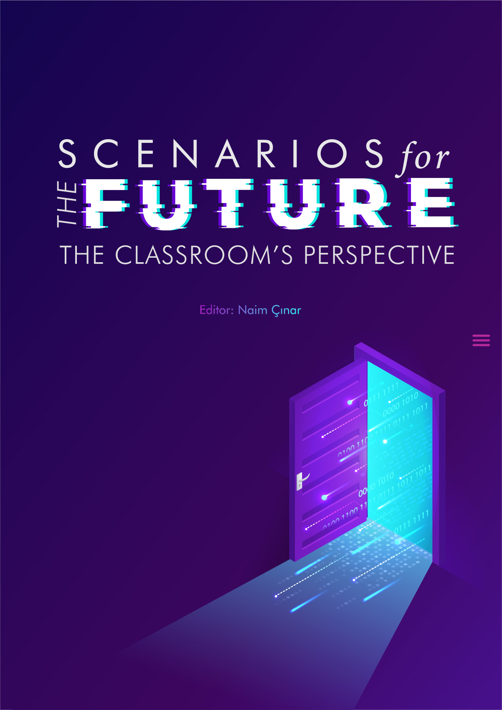

--- 
title: "Scenarios for the Future: The Classroom's Perspective"
author: "Naim Çınar"
date: "`r Sys.Date()`"
site: bookdown::bookdown_site
output: bookdown::gitbook
documentclass: book
bibliography: [book.bib, packages.bib]
biblio-style: apalike
link-citations: yes
cover-image: images/book-cover.jpg
github-repo: rstudio/future-scenarios
description: "A collection of future scenarios based on different themes and scenario archetypes."
---

# Prerequisites {-}


Cover design: Berna Görgülü

This book was generated by Naim Çınar in **Markdown**, using R version 3.6.3

The **bookdown** package can be installed from CRAN or Github:

```{r eval=FALSE}
install.packages("bookdown")
# or the development version
# devtools::install_github("rstudio/bookdown")
```

This book is hosted on **[Bookdown](https://bookdown.org)**

<a rel="license" markdown="1" href="http://creativecommons.org/licenses/by-nc-sa/4.0/"></a><br />This work is licensed under a <a rel="license" href="http://creativecommons.org/licenses/by-nc-sa/4.0/">Creative Commons Attribution-NonCommercial-ShareAlike 4.0 International License</a>.

**Citing the book**

As the structure of the book’s chapters and sections may change, links should only use the base URL https://bookdown.org/naimcinar/future-scenarios/.

The full reference of this book is:

Çınar, N.(Ed.). (2021). Scenarios for the Future: The Classroom's Perspective (version 0.1.0, Feb 1, 2021).
Retrieved from https://bookdown.org/naimcinar/future-scenarios/.


```{r include=FALSE}
# automatically create a bib database for R packages
knitr::write_bib(c(
  .packages(), 'bookdown', 'knitr', 'rmarkdown'
), 'packages.bib')
```
